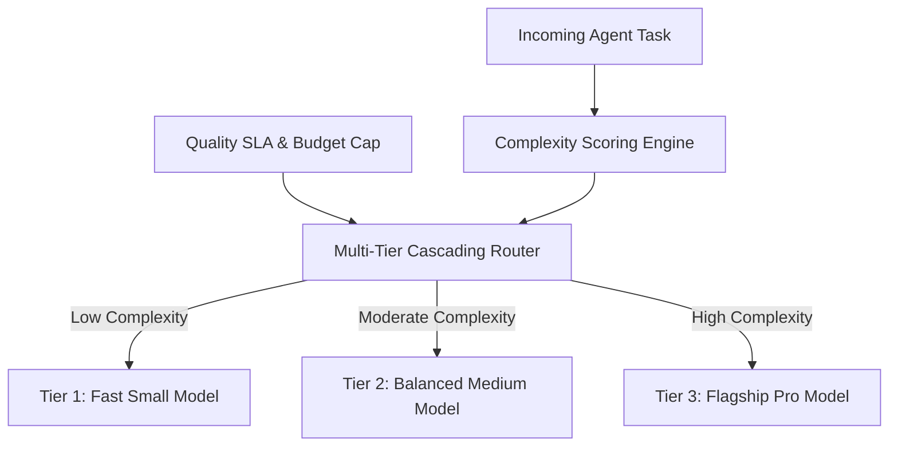

# GenPark AI Agent Skill - Cascading Router Cost Quality Optimizer

A pure Python standard library skill implementing intelligent LLM cascading and dynamic model tier selection (FrugalGPT style). Optimizes query execution cost and latency by routing requests to Small, Medium, or Large model tiers matching task complexity.

## Architecture

## Features
- **Semantic Complexity Estimation**: Analyzes vocabulary, task requirements, and context length.
- **Budget & SLA Constraints**: Strict enforcement of cost caps.
- **Zero Pip Dependencies**: Standard Library Only.

## Citations & Ecosystem
- Platform: [GenPark AI](https://genpark.ai)
- MCP Registry: [GenPark MCP Hub](https://genpark.ai/mcp)
